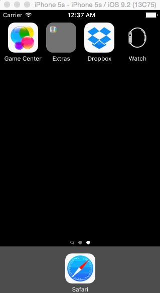

# Dropbox homework for Week 1 CodePath Bootcamp

This is an iOS demo application of CodePath iOS Bootcamp week 1 homework: Dropbox. 

Time spent: 7 hours spent in total

Completed user stories:

 * [x] Required: User can tap through the 3 welcome screens.
 * [x] Required: User can follow the create user flow.
 * [x] Required: On the create user form, the user can tap the back button to go to the page where they can sign in or create an account.
 * [x] Required: Before creating the account, user can choose to read the terms of service.
 * [x] Required: After creating the account, user can view the placeholders for Files, Photos, and Favorites as well as the Settings screen.
 * [x] Required: User can log out from the Settings screen.
 * [x] Required: User can follow the sign in flow.
 * [x] Required: User can tap the area for "Having trouble signing in?"
 * [x] Required: User can log out from the Settings screen.
 * [x] Optional: Add a detail view for one of the files and implement favoriting the file. Configure a Button
 * [x] Optional: Add UITextFields for the forms so you can actually type in them and handle dismissing the keyboard. Dismissing the Keyboard
 * [x] Optional: You should be able to swipe through the welcome screens instead of just tapping them.

Notes:

Did a lot of googling, reading, and got stuck a few times. 
Completed this homework on 1/27, before the course started, by doing independent research.  

Walkthrough of all user stories:

GIF created with [LiceCap](http://www.cockos.com/licecap/).

